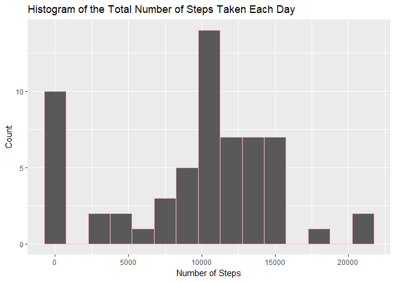
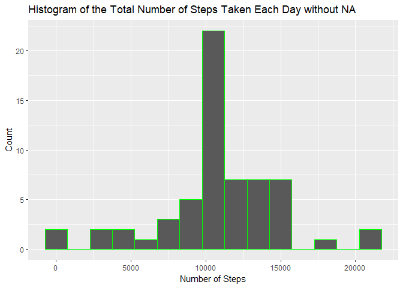
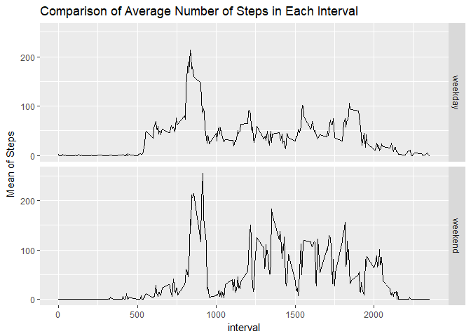

---  
    title: "Reproducible Research"  
    author: "Olga SILVA"  
    date: "June 27 2018"
    output:  
      html_document:  
        keep_md: true  
---  


#Reproducible Research: Peer Assessment 1#

=============================================================================================================
Load the libraries

```r
library("ggplot2")
library("dplyr")
```

```
## 
## Attaching package: 'dplyr'
```

```
## The following objects are masked from 'package:stats':
## 
##     filter, lag
```

```
## The following objects are masked from 'package:base':
## 
##     intersect, setdiff, setequal, union
```

Load, read and transform the data

```r
setwd("//cib.net/shareparis/Home13/silvaol/PRIVE/COURSERA/Data Science R/Reproducible Research")
activity=read.csv("activity.csv")
```

**What is mean total number of steps taken per day?**

1. Calculate the total number of steps taken per day


```r
stepsbyday <- group_by(activity,date)
msteps<-summarize(stepsbyday,sum(steps,na.rm = TRUE))
names(msteps)<-(c("date","sum_steps"))
```

2. Make a histogram of the total number of steps taken each day

```r
ggplot(data=msteps, aes(msteps$sum_steps)) + geom_histogram(binwidth = 1500, col = "pink")+
xlab("Number of Steps") +
ylab("Count") +
ggtitle("Histogram of the Total Number of Steps Taken Each Day")
```

<!-- -->

3. Calculate and report the mean and median of the total number of steps taken per day

```r
mean(msteps$sum_steps)
```

```
## [1] 9354.23
```

```r
median(msteps$sum_steps)
```

```
## [1] 10395
```

**What is the average daily activity pattern?**

1. Make a time series plot of the 5-minute interval and the average number of steps taken, averaged across all days

```r
five_min <- aggregate(steps ~ interval, data = activity, FUN =mean)
plot(five_min, type = "l")
```

<!-- -->

2. Which 5-minute interval, on average across all the days in the dataset, contains the maximum number of steps?

```r
five_min[which.max(five_min$steps),]
```

```
##     interval    steps
## 104      835 206.1698
```

**Imputing missing values**

1. Calculate and report the total number of missing values in the dataset

```r
apply(activity, 2, function(x) sum(is.na(x)))
```

```
##    steps     date interval 
##     2304        0        0
```

2. Devise a strategy for filling in all of the missing values in the dataset.

```r
replace_mean <- function(num) replace(num, is.na(num), mean(num, na.rm = TRUE))
activity %>% group_by(interval) %>% mutate(steps = replace_mean(steps))
```

```
## # A tibble: 17,568 x 3
## # Groups:   interval [288]
##     steps date       interval
##     <dbl> <fct>         <int>
##  1 1.72   2012-10-01        0
##  2 0.340  2012-10-01        5
##  3 0.132  2012-10-01       10
##  4 0.151  2012-10-01       15
##  5 0.0755 2012-10-01       20
##  6 2.09   2012-10-01       25
##  7 0.528  2012-10-01       30
##  8 0.868  2012-10-01       35
##  9 0      2012-10-01       40
## 10 1.47   2012-10-01       45
## # ... with 17,558 more rows
```

3. Create a new dataset that is equal to the original dataset but with the missing data filled in

```r
new_data<-as.data.frame(activity %>% group_by(interval) %>% mutate(steps = replace_mean(steps)))
```

4. Make a histogram of the total number of steps taken each day and Calculate and report the mean and median total number of steps taken per day


```r
stepsbyday2 <- group_by(new_data,date)
msteps2<-summarize(stepsbyday2,sum(steps))
names(msteps2)<-(c("date","sum_steps2"))
ggplot(data=msteps2, aes(msteps2$sum_steps2)) + geom_histogram(binwidth = 1500, col = "green")+
xlab("Number of Steps") +
ylab("Count") +
ggtitle("Histogram of the Total Number of Steps Taken Each Day without NA")
```

<!-- -->


```r
new_mean<-mean(msteps2$sum_steps2)
new_median<-median(msteps2$sum_steps2)
old_mean<-mean(msteps$sum_steps)
old_median<-median(msteps$sum_steps)
```

The first mean is 9354.2295082, the mean without NA is 1.0766189\times 10^{4}
The first median is 10395, the median without NA is 1.0766189\times 10^{4}

**Are there differences in activity patterns between weekdays and weekends?**

1. Create a new factor variable in the dataset with two levels - "weekday" and "weekend" indicating whether a given date is a weekday or weekend day.


```r
new_data$day<-as.POSIXlt(new_data$date)$wday
new_data$Weekday <-ifelse(new_data$day > 5, "weekend", "weekday")
```

2. Make a panel plot containing a time series plot of the 5-minute interval (x-axis) and the average number of steps taken, averaged across all weekday days or weekend days (y-axis). 


```r
five_min2 <- (new_data %>% group_by(interval, Weekday) %>% summarize(Mean = mean(steps)))
ggplot(five_min2, aes(interval, Mean)) + geom_line() + facet_grid(Weekday ~ .)+ylab("Mean of Steps") +
    ggtitle("Comparison of Average Number of Steps in Each Interval")
```

<!-- -->
